## GitHub Stats
<!-- Image start -->

 
    

 

  

    

  

    

 

<!-- Image end -->

## Projects and Workspace

---

*   C/C++ Development
*   Reverse Engineering
*   Malware Analysis
*   Vulnerability Research
*   Exploit Development
*   Network Behavior Anomaly Detection
*   Windows Internals
*   Linux Driver Development
*   Compiler Development
*   Capture the Flag (CTF) 
*   Artificial Intelligence and Cybersecurity Research
*   Smart Contracts

## 💻 Tech Stack:
---

### Programming Languages

*   
*   
*   

### AI Framework
*  
*  

### Database
* 
* 

## 📫 How to reach me
---

<!---
cybersecurity-dev/cybersecurity-dev is a ✨ special ✨ repository because its `README.md` (this file) appears on your GitHub profile.
You can click the Preview link to take a look at your changes.

- 💞️ I’m looking to collaborate on ...
- 😄 Pronouns: ...
- ⚡ Fun fact: ...

--->
